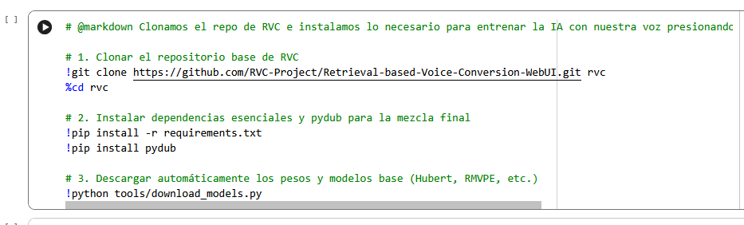
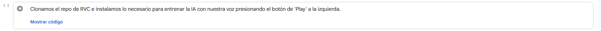
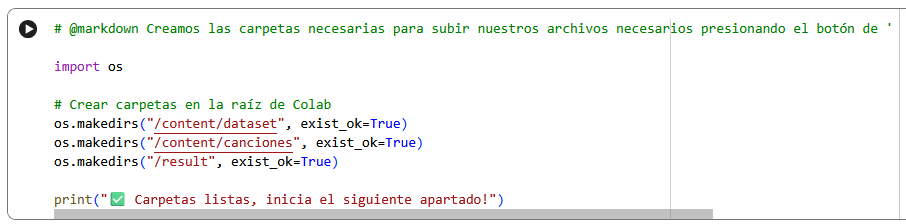
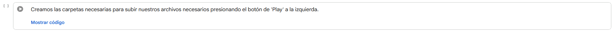
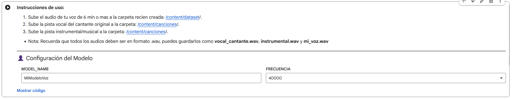
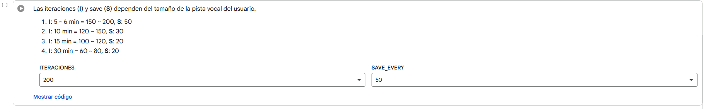
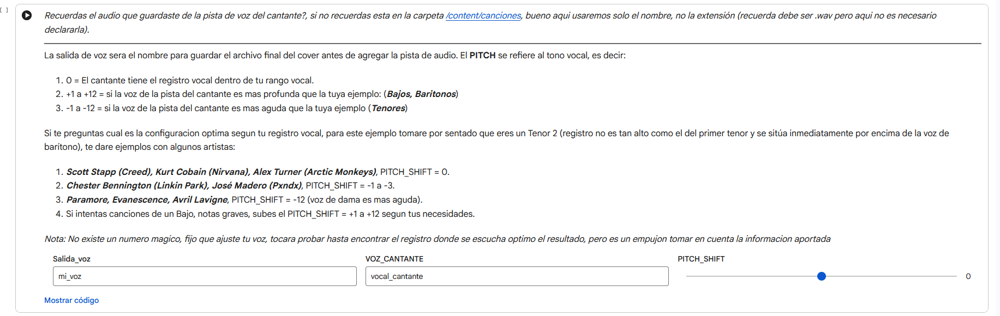
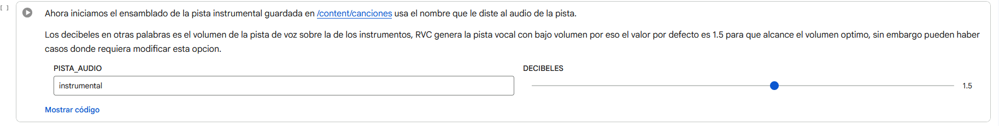

# 🎵 Generador de Covers — Google Colab

Una solución automatizada, elegante y simplificada basada en **RVC v2 (Retrieval-based Voice Conversion)** para entrenar modelos de Inteligencia Artificial con tu propia voz y generar covers musicales de alta calidad directamente desde la nube de Google Colab.

---

## 🚀 Inicio Rápido

No necesitas instalar nada en tu computadora. Todo el procesamiento pesado se realiza utilizando las GPUs gratuitas de Google. Haz clic en el siguiente botón para abrir el entorno de ejecución, el cuaderno de colab tiene instrucciones detalladas paso a paso, asegurate de no saltar nada para que funcione al 100%:

---

## 📂 Preparación de Archivos

Antes de iniciar el cuaderno, asegúrate de tener listos tus tres archivos de audio esenciales en formato `.wav`:

| Archivo | Descripción | Duración Recomendada |
| :--- | :--- | :--- |
| 🎙️ `mi_voz.wav` | El dataset con tu voz limpia, sin música de fondo ni ruidos. | Más de 6 minutos |
| 🎤 `vocal_cantante.wav` | La pista a capella (solo la voz) del artista original. | Duración de la canción |
| 🎸 `instrumental.wav` | La pista musical/pista de fondo sin la voz del artista. | Duración de la canción |

---

## 🛠️ Guía de Uso Paso a Paso

El cuaderno está diseñado con una interfaz minimalista (Formularios de Colab) que oculta el código complejo para ofrecer una experiencia limpia.

### Paso 1: Inicialización del Entorno
Ejecuta la primera celda para clonar el repositorio principal de RVC, instalar todas las dependencias necesarias y descargar los pesos de los modelos base (`Hubert`, `RMVPE`, etc.).

> 💡 *Nota: El panel se mostrará limpio con las cajas de código colapsadas por defecto.*

### Paso 2: Creación del Espacio de Trabajo
Presiona 'Play' en la segunda celda para generar automáticamente el árbol de directorios dentro de Colab. Una vez creadas las carpetas, sube tus audios `.wav` a sus respectivos destinos utilizando el panel lateral izquierdo de Colab:
* Sube tu dataset a: `/content/dataset/`
* Sube las pistas de la canción a: `/content/canciones/`

> 💡 *Nota: El panel se mostrará limpio con las cajas de código colapsadas por defecto.*

### Paso 3: Procesamiento del Dataset e Index
Configura el nombre de tu modelo y ejecuta la celda de procesamiento. El script se encargará de:
1. Normalizar y trocear tu audio.
2. Extraer las características de tono ($f_0$) en GPU usando el algoritmo avanzado **RMVPE**.
3. Generar el archivo de similitud de voz `.index`.

### Paso 4: Entrenamiento de la IA
Ajusta la cantidad de iteraciones (Épocas) basándote en la duración de tu audio gracias a la tabla de guía interactiva incluida. El sistema entrenará el archivo final `.pth` de manera óptima aprovechando la VRAM asignada.

### Paso 5: Inferencia AI (Conversión de Voz)
Escribe el nombre de la pista del cantante y ajusta el **Pitch Shift (Tono Vocal)** según el registro del artista original (Barítono, Tenor o Soprano) para garantizar que tu clon de voz no se distorsione en las notas difíciles.

### Paso 6: Mezcla de Audio Profesional
Ajusta los decibeles (`dB`) para que la potencia de tu voz clonada destaque correctamente y no quede opacada por la música. La librería `pydub` unirá ambas pistas de forma milimétrica.

---

## 🎛️ Guía Rápida de Configuración de Pitch

Para que tus covers suenen naturales, toma como referencia esta guía basada en un hombre que tiene rango vocal de Tenor2:

> *ten en cuenta que cada valor corresponde a medio tono -1 = bajar medio tono*

* **Mismo rango (ej. Creed, Nirvana):** Mantén el slider en `0`.
* **Cantante más agudo (ej. Linkin Park, Pxndx):** Baja entre `-1` y `-3` semitonos.
* **Canciones de mujeres (ej. Evanescence, Paramore):** Baja exactamente `-12` semitonos (una octava completa).

---

## 📝 Licencia

Este proyecto está bajo la Licencia MIT. Siéntete libre de clonarlo, modificarlo y compartirlo.

